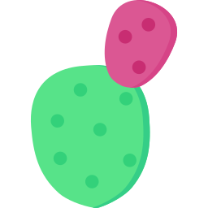

# Ficurinia

A prickly blog theme for Hugo


# [Demo](https://gabmus.org)

[Code for the demo website](https://gitlab.com/gabmus/gabmus.gitlab.io) (really my personal website)

[Screenshot gallery](https://gabmus.gitlab.io/hugo-ficurinia-screenshots/) showcasing 256 of the possible configurations that Ficurinia offers.

# Customization

## Configuration

These are some parameters you can use in your `config.toml` to customize Ficurinia:

```toml
baseURL = "https://example.com/"
theme = "hugo-ficurinia"
title = "My nice blog"

# this will be included in the footer after the current year the site is last
# built, followed by the (c) symbol
# you can use markdown inside this field
copyright = "Some copyright notice - [my license](https://example.com/license)"

paginate = 5  # number of articles per page in the index
summaryLength = 70  # number of words for article summaries


[params]
    author = "Gabriele Musco"
    description = "A description for my website"  # this will be added as metadata

    logo = "/images/mylogo.png"
    favicon = "/images/myfavicon.png"
    showTags = true  # show the Tags menu item; default true
    showRss = true  # show the link for the RSS feed; default true

    imageInArticlePreview = false  # show images in article preview; default false

    navtype = "standard"  # changes the style of the pagination, available styles are: "standard", "circles"
    fontFamily = "JetBrains Mono"  # changes the font, default "JetBrains Mono"
    monospaceFontFamily = "JetBrains Mono"  # changes the monospace font for code, default "JetBrains Mono"
    contentWidth = "1000px"  # maximum width of the site content, css syntax

    discreteCards = false  # enable discrete card style; default false
    gridView = false  # show post list as a grid. goes well with discreteCards
    highlightBgColor = "#34363b"  # card and circle navigation background color for discrete card mode

    enableSearch = true  # enable search page
    searchbarEverywhere = true  # if the searchbar should be shown in every page; requires enableSearch
    searchMenuLink = false  # add a search link to the navigation menu; requires enableSearch
    mobileHamburgerNav = false  # alternative hamburger menu layout for the main nav menu when screen is small

    enableFeatured = false  # enable a particular view for articles marked as featured (featured: true in the article frontmatter)

    # enable comments support with commento using the script from your server
    commento = "https://example.com/js/commento.js"

    # enable analytics using Plausible
    plausibleScriptUrl = "https://something.com/..."
    plausibleDomain = "example.com"

    # WARNING: deprecated! Use [[menu.icons]] instead, look below
    # links = [
    #     ["GitLab", "https://gitlab.com/gabmus"],
    #     ["GNOME", "https://gitlab.gnome.org/gabmus"],
    #     ["YouTube", "https://youtube.com/TechPillsNet"]
    # ]

    # you can customize all of the colors in this theme
    # the values shown are the defaults
    backgroundColor = "#242629"
    foregroundColor = "white"
    dimForegroundColor = "#bababa"
    strokeColor = "#4f4f4f"
    accentColor = "#db5793"

    # redirect to baseURL if current URL host doesn't match
    # useful if deploying in gitlab pages with custom domain and don't want
    # the username.gitlab.io/website url to persist
    # this requires you to set baseURL (see above)
    forceRedirect = false

    infiniteScrolling = false  # activates infinite scrolling instead of regular pagination
    enableFooterColumns = false  # activates footer columns, as described below
    # related articles will be selected randomly based on tags and shown at
    # the bottom of the article, after the comments
    enableRelatedArticles = false
    relatedArticlesNum = 2  # how many related articles to show
    randomRelated = false  # sorts related articles in random order (randomized at built time)

[menu]
    # these links will be added to the main navigation menu, sorted by weight
    # other elements in this menu are added automatically from the "pages" folder
    # the folder it will look into can be customized with the pages variable
    # in params above
    [[menu.main]]
        identifier = "about"
        name = "About"
        url = "/about/"
        weight = 10
    # these links (menu.icons) will be added as icon links below the main nav
    [[menu.icons]]
        identifier = "gitlab"
        name = "GitLab"
        url = "https://gitlab.com/gabmus"
        weight = 10
    [[menu.icons]]
        identifier = "gnome"
        name = "GNOME GitLab"
        url = "https://gitlab.gnome.org/gabmus"
        weight = 20

# this section is necessary if you want infinite scrolling
# it allows to output the article list as paged JSON so that "pages" can be retrieved via javascript
[outputs]
    home = ["HTML", "JSON"]
```

### Supported icons

For the `[[menu.icons]]` menu. They match identifier, name and url can be whatever. Here's a list of supported identifiers:

- email
- facebook
- github
- gitlab
- gnome
- instagram
- linkedin
- mastodon
- matrix
- peertube
- phone
- pleroma
- rss
- steam
- telegram
- twitter
- xmpp
- youtube

## Footer columns

You can add various columns of links in the footer using the `data/footer_columns.yml` file.

Following is an example configuration:

```yaml
- title: My other projects
  links:
    - title: HydraPaper
      link: https://hydrapaper.gabmus.org
    - title: Ada UI
      link: https://gitlab.com/gabmus/ada-ui
- title: About me
  links:
    - title: My personal website
      link: https://gabmus.org
    - title: My GitLab
      link: https://gitlab.com/gabmus
    - title: My GNOME GitLab
      link: https://gitlab.gnome.org/gabmus
```

## Params supported in a post frontmatter

| Param | Description |
|-------|-------------|
| `tags` | An array of tags, useful for searching similar articles |
| `description` | A brief description of the post, useful for SEO optimization |
| `featured` | Boolean, indicate if the post should be shown as featured |

## Inject custom content

Ficurinia supports injecting custom content into the theme. There are several files you can create in `layouts/partials/inject` that will be included inside the theme in different places.

| Partial | Placement |
|---------|-----------|
| `layouts/partials/inject/body.html` | Before closing the `body` tag |
| `layouts/partials/inject/content-after.html` | After a post or page content |
| `layouts/partials/inject/content-before.html` | Before a post or page content |
| `layouts/partials/inject/footer.html` | At the beginning of the footer |
| `layouts/partials/inject/head.html` | Before closing the `head` tag |
| `layouts/partials/inject/header-after.html` | Before closing the header |
| `layouts/partials/inject/header-before.html` | At the beginning of the header |

# Does *Ficurinia* mean anything?

It's Sicilian for Indian fig, also known as prickly pear cactus.
